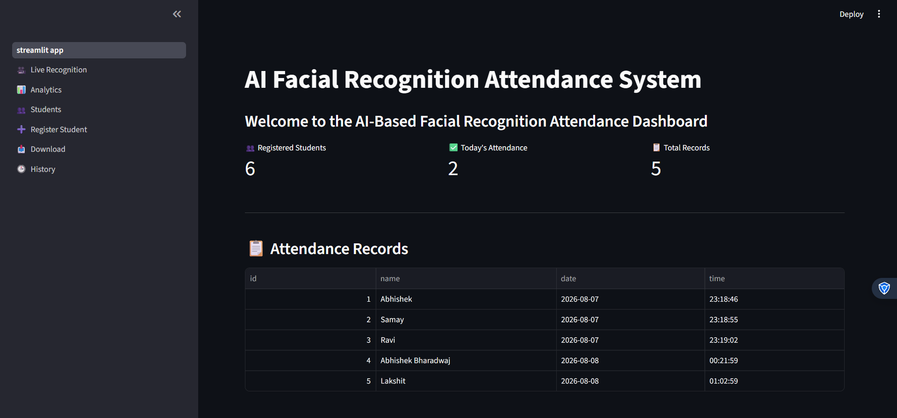
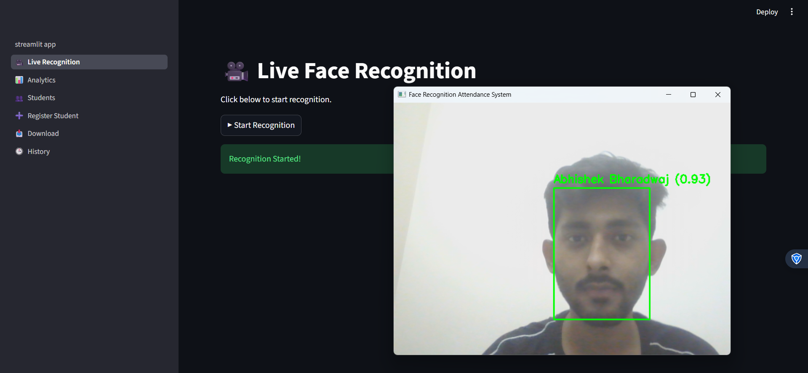
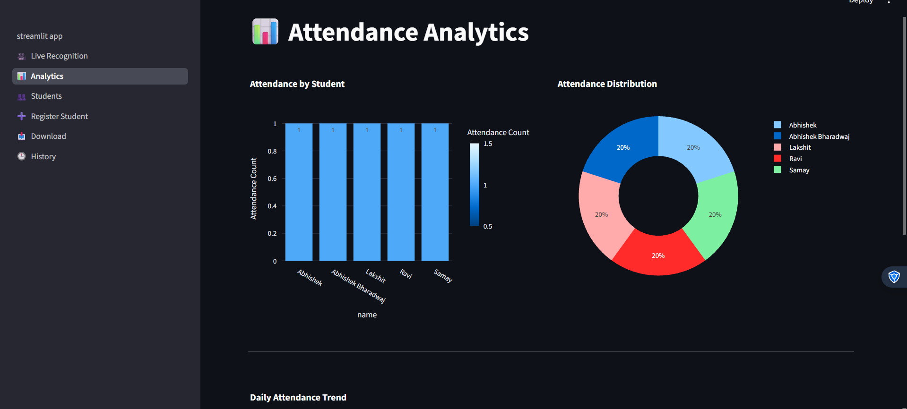
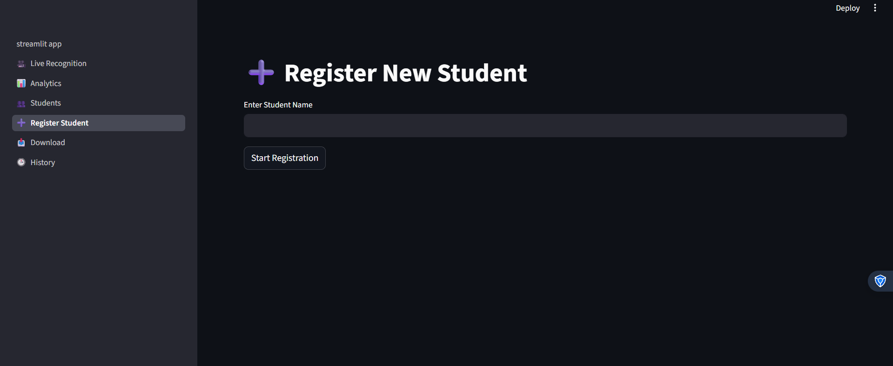
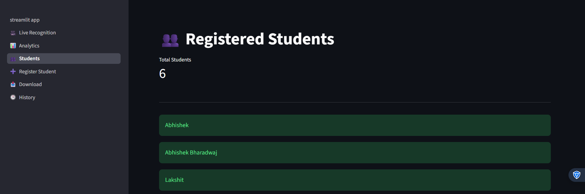
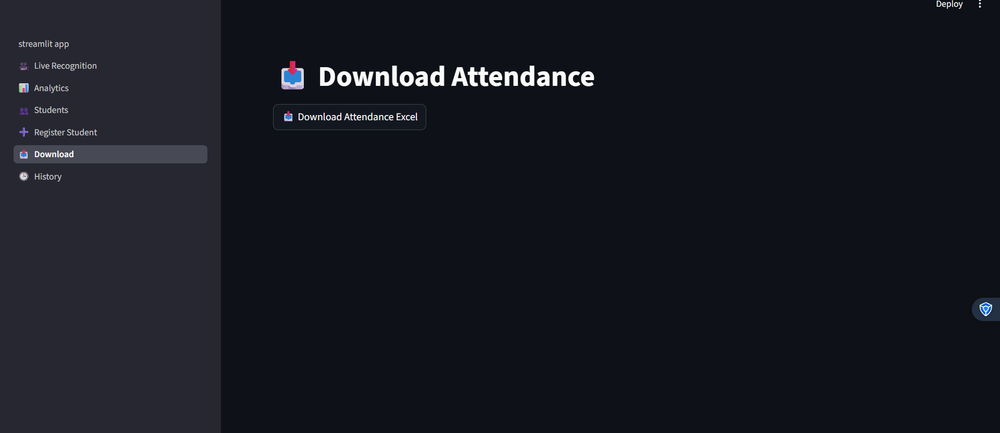
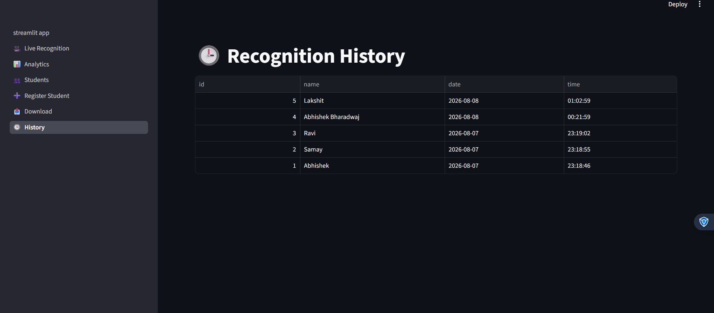

# 🎯 AI-Based Facial Recognition Attendance System

An end-to-end **AI-powered Facial Recognition Attendance System** built using **InsightFace, OpenCV, SQLite, and Streamlit**. The application automatically detects and recognizes faces in real-time, marks attendance, stores records in a database, and provides an interactive analytics dashboard.

---

## 🚀 Features

- 👤 Face Registration
- 🧠 AI-Based Face Recognition using InsightFace
- 📷 Real-Time Face Detection with Webcam
- ✅ Automatic Attendance Marking
- 🗄 SQLite Database Integration
- 📊 Interactive Streamlit Dashboard
- 📈 Attendance Analytics & Visualization
- 📥 Export Attendance to Excel
- 👥 Student Management
- 📜 Attendance History
- 🚨 Unknown Face Logging
- 🏗 Modular Project Architecture

---

## 🛠 Tech Stack

### Programming Language
- Python

### Computer Vision & AI
- InsightFace
- OpenCV
- ONNX Runtime
- NumPy
- Scikit-learn (Cosine Similarity)

### Database
- SQLite

### Dashboard
- Streamlit
- Plotly
- Pandas

### File Handling
- OpenPyXL

---

## 📂 Project Structure

```text
AI-Based-Facial-Recognition-Attendance-System/

│
├── app.py
├── streamlit_app.py
├── generate_embeddings.py
├── register_student.py
├── export_attendance.py
├── requirements.txt
├── README.md
│
├── assets/
├── pages/
├── utils/
├── database/
├── dataset/
├── embeddings/
├── exports/
├── unknown_faces/
└── screenshots/
```

---

## ⚙️ Installation

### Clone the Repository

```bash
git clone https://github.com/YOUR_USERNAME/AI-Based-Facial-Recognition-Attendance-System.git

cd AI-Based-Facial-Recognition-Attendance-System
```

### Install Dependencies

```bash
pip install -r requirements.txt
```

---

## ▶️ Running the Project

### 1️⃣ Generate Face Embeddings

```bash
python generate_embeddings.py
```

---

### 2️⃣ Register a New Student

```bash
python register_student.py
```

---

### 3️⃣ Start Face Recognition

```bash
python app.py
```

---

### 4️⃣ Launch Dashboard

```bash
python -m streamlit run streamlit_app.py
```

---

### 5️⃣ Export Attendance

```bash
python export_attendance.py
```

---

## 📊 Dashboard Features

- Registered Students
- Today's Attendance
- Total Attendance Records
- Attendance Analytics
- Student Management
- Attendance History
- Excel Download

---

## 🧠 How It Works

1. Register students by capturing face images.
2. Generate facial embeddings using InsightFace.
3. Store embeddings for future recognition.
4. Detect faces in real time.
5. Compare embeddings using cosine similarity.
6. Recognize the student.
7. Mark attendance automatically.
8. Store attendance in SQLite.
9. Display analytics on the Streamlit dashboard.

---

## 📸 Screenshots

### Dashboard



### Live Recognition



### Analytics



### Register Student



### Students Page



### Download Page



### Attendance History




---

## 📈 Future Improvements

- Live camera feed inside Streamlit
- Face anti-spoofing
- Multi-camera support
- Email attendance reports
- Cloud database integration
- User authentication
- Docker deployment
- REST API integration

---

## 🎓 Learning Outcomes

This project demonstrates:

- Computer Vision
- Deep Learning
- Face Recognition
- Feature Embeddings
- Cosine Similarity
- SQLite Database Management
- Streamlit Dashboard Development
- Python Application Development
- Modular Software Design

---

## 📄 License

This project is licensed under the MIT License.

---

## 👨‍💻 Author

**Abhishek Bharadwaj**

📧 Email: abhishekbharadwaj120@gmail.com

🔗 LinkedIn: https://www.linkedin.com/in/abhishek-bharadwaj-63b075317/

💻 GitHub: https://github.com/AbhishekBharadwaj2003

---
